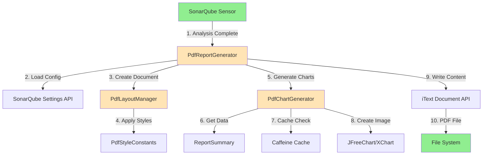

# SonarQube AI OWASP Security Plugin - PDF Report Enhancement Architecture

## Introduction

This document outlines the architectural approach for enhancing the SonarQube AI OWASP Security Plugin with **enterprise-grade PDF report generation capability**. Its primary goal is to serve as the guiding architectural blueprint for AI-driven development of the PDF reporting feature while ensuring seamless integration with the existing report-generator module.

**Relationship to Existing Architecture:**
This document supplements the existing project architecture (`docs/architecture.md`) by defining how the PDF report generator will integrate with current systems. The enhancement follows the existing Strategy Pattern for report generators and reuses all existing data models, ensuring zero disruption to current Markdown report functionality.

### Existing Project Analysis

#### Current Project State

- **Primary Purpose:** AI-driven OWASP security analysis plugin for SonarQube with intelligent fix suggestions
- **Current Tech Stack:** Java 11+, Maven 3.8+, SonarQube Plugin API 9.9+, Jackson 2.x, OkHttp 4.x, Caffeine Cache 3.x
- **Architecture Style:** Maven Monorepo (7 modules), Strategy Pattern for report generators, Builder Pattern for data models
- **Deployment Method:** SonarQube plugin JAR, deployed to `$SONARQUBE_HOME/extensions/plugins/`

#### Available Documentation

- Comprehensive PRD v1.0 (`docs/prd.md`) covering entire plugin functionality
- Detailed architecture document (`docs/architecture.md`) with 7-module structure
- Project brief (`docs/brief.md`) with market analysis and user personas
- PDF Enhancement PRD (`docs/prd-pdf-enhancement.md`) completed 2025-10-20

#### Identified Constraints

- Must use Java 11+ for SonarQube 9.9+ compatibility
- Cannot modify existing `AnalysisReport`, `SecurityFinding`, `ReportSummary` data models
- Must implement `ReportGenerator` interface (`generate()` and `getFormat()` methods)
- Cannot impact existing Markdown report generator functionality
- Plugin JAR size must not exceed 60 MB (currently ~50 MB)
- PDF generation time must be < 15 seconds for 100 security issues
- iText 7 AGPL license requires clear documentation for enterprise customers

### Change Log

| Date | Version | Description | Author |
|------|---------|-------------|--------|
| 2025-10-20 | 1.0 | Initial PDF Enhancement Architecture based on PRD v1.0 | BMad Master |

---

## Enhancement Scope and Integration Strategy

### Enhancement Overview

**Enhancement Type:** New Feature Addition (Isolated)
**Scope:** Add PDF report generation capability to `report-generator` module
**Integration Impact:** Minimal - isolated addition with zero modifications to existing components

### Integration Approach

**Code Integration Strategy:**
- Create new `com.github.sonarqube.report.pdf` package within `report-generator` module
- Implement `PdfReportGenerator` class that implements existing `ReportGenerator` interface
- Reuse all existing data models (`AnalysisReport`, `SecurityFinding`, `ReportSummary`)
- No modifications to `MarkdownReportGenerator` or any existing classes

**Database Integration:**
- No new database tables required
- PDF configuration (logo path, title, theme) stored via SonarQube Settings API
- Uses same storage mechanism as existing AI API key configuration

**API Integration:**
- No new public APIs required
- PDF generator registered internally via `ReportGenerator` interface
- SonarQube Sensor calls appropriate generator based on user format selection

**UI Integration:**
- Extend existing report export UI with PDF format option (radio button/dropdown)
- Add new "PDF Report Settings" panel in SonarQube Configuration
- Use SonarQube Extension API and React component library for UI consistency

### Compatibility Requirements

- **Existing API Compatibility:** Full compatibility - implements existing `ReportGenerator` interface without modifications
- **Database Schema Compatibility:** No schema changes - uses SonarQube Settings API for configuration
- **UI/UX Consistency:** Follows SonarQube design system (color palette #4B9FD5, React components)
- **Performance Impact:** < 15 seconds PDF generation for 100 issues, no impact on existing Markdown generation

---

## Tech Stack

### Existing Technology Stack

| Category | Current Technology | Version | Usage in Enhancement | Notes |
|----------|-------------------|---------|---------------------|-------|
| Language | Java | 11+ | All PDF generator code | No change required |
| Build Tool | Maven | 3.8+ | Build and package PDF module | Add iText dependency |
| Framework | SonarQube Plugin API | 9.9+ | Plugin integration | No change required |
| Data Processing | Jackson | 2.x | Not used in PDF gen | Existing for JSON reports |
| Caching | Caffeine Cache | 3.x | Chart image caching | Reuse for PDF charts |
| Testing | JUnit 5 + Mockito | Latest | Unit & integration tests | No change required |

### New Technology Additions

| Technology | Version | Purpose | Rationale | Integration Method |
|-----------|---------|---------|-----------|-------------------|
| iText 7 | 7.2.5+ | PDF generation engine | Industry-standard PDF library with comprehensive features (charts, bookmarks, PDF/A compliance) | Maven dependency in report-generator pom.xml |
| JFreeChart or XChart | Latest stable | Chart generation (pie/bar) | Generate PNG images for embedding in PDF | Maven dependency, images converted to iText Image objects |
| Apache PDFBox | Latest stable | PDF validation in tests | Verify PDF structure in integration tests | Maven test dependency |

**iText 7 License Note:**
- Dual license: AGPL 3.0 (open source) or Commercial License
- AGPL requires source code disclosure if distributing modified versions
- **Recommendation**: Document license clearly in README and provide commercial license purchase guidance for enterprise customers

---

## Data Models and Schema Changes

### Data Models Integration

**No new data models required.** PDF report generator fully reuses existing models:

1. **AnalysisReport** (`report-generator/src/main/java/com/github/sonarqube/report/model/AnalysisReport.java`)
   - **Usage**: Primary input for PDF generation
   - **Integration**: Passed to `PdfReportGenerator.generate(AnalysisReport report)`
   - **No modifications**: All fields used as-is (projectName, owaspVersion, analysisTime, findings, summary, aiModel)

2. **SecurityFinding** (`report-generator/src/main/java/com/github/sonarqube/report/model/SecurityFinding.java`)
   - **Usage**: Individual security issue details
   - **Integration**: Rendered in "Detailed Findings" section of PDF
   - **No modifications**: All fields rendered (ruleKey, ruleName, filePath, lineNumber, severity, owaspCategory, cweIds, description, codeSnippet, fixSuggestion)

3. **ReportSummary** (`report-generator/src/main/java/com/github/sonarqube/report/model/ReportSummary.java`)
   - **Usage**: Executive summary statistics and charts
   - **Integration**: Rendered in executive summary page and used for chart data
   - **No modifications**: All fields used (totalFindings, severityCounts, categoryCounts, blockerCount, criticalCount, majorCount, filesAnalyzed)

### New Internal Models (Non-persistent)

**PdfReportConfig** (Configuration POJO, not persisted to DB):
```java
public class PdfReportConfig {
    private String logoPath;           // Path to company logo (stored in SonarQube data/)
    private String reportTitle;        // Custom report title
    private ColorTheme colorTheme;     // DEFAULT, DARK, LIGHT
    private boolean headerFooterEnabled; // Enable/disable headers/footers

    // Builder pattern for construction
    public static Builder builder() { ... }
}
```

**Storage**: Configuration values stored via SonarQube Settings API as key-value pairs:
- `owasp.pdf.logo.path` → String
- `owasp.pdf.report.title` → String
- `owasp.pdf.color.theme` → Enum (DEFAULT/DARK/LIGHT)
- `owasp.pdf.header.footer.enabled` → Boolean

### Schema Integration Strategy

**Database Changes Required:** None

**Configuration Storage:**
- Use SonarQube `Configuration` API (same as AI API keys)
- Key-value pairs stored in SonarQube's internal properties table
- Logo file stored in `<sonarqube-data>/owasp-plugin/logo.png`

**Backward Compatibility:**
- All configuration optional with sensible defaults
- PDF generator works without any configuration (uses default styling)
- Existing Markdown generator completely unaffected

---

## Component Architecture

### New Components

#### Component 1: PdfReportGenerator

**Responsibility:** Main PDF report generation orchestrator implementing ReportGenerator interface

**Integration Points:**
- Implements `ReportGenerator` interface
- Called by SonarQube Sensor after analysis completes
- Delegates to `PdfLayoutManager` for document structure
- Delegates to `PdfChartGenerator` for visual charts

**Key Interfaces:**
```java
public class PdfReportGenerator implements ReportGenerator {
    @Override
    public String generate(AnalysisReport report) throws ReportGenerationException;

    @Override
    public String getFormat();  // Returns "pdf"

    @Override
    public String getFileExtension();  // Returns ".pdf"
}
```

**Dependencies:**
- **Existing Components:** `AnalysisReport` (data input), `SecurityFinding`, `ReportSummary`
- **New Components:** `PdfLayoutManager`, `PdfChartGenerator`, `PdfReportConfig`

**Technology Stack:** Java 11+, iText 7, Caffeine Cache

---

#### Component 2: PdfLayoutManager

**Responsibility:** Manages PDF document structure (cover page, TOC, headers/footers, page breaks)

**Integration Points:**
- Called by `PdfReportGenerator` to structure document
- Uses iText `Document`, `PdfWriter`, `PdfPageEventHelper` APIs
- Applies `PdfReportConfig` for branding and styling

**Key Interfaces:**
```java
public class PdfLayoutManager {
    public void createCoverPage(Document doc, AnalysisReport report, PdfReportConfig config);
    public void createTableOfContents(Document doc, List<Section> sections);
    public void addHeaderFooter(PdfWriter writer, PdfReportConfig config);
    public void addPageBreak(Document doc);
}
```

**Dependencies:**
- **Existing Components:** `AnalysisReport` (for cover page data)
- **New Components:** `PdfReportConfig`, `PdfStyleConstants`

**Technology Stack:** iText 7 (Document, PdfWriter, PdfPageEventHelper)

---

#### Component 3: PdfChartGenerator

**Responsibility:** Generates visual charts (pie chart for severity, bar chart for OWASP categories)

**Integration Points:**
- Called by `PdfReportGenerator` to create chart images
- Uses `ReportSummary` data for chart generation
- Caches generated charts using Caffeine Cache

**Key Interfaces:**
```java
public class PdfChartGenerator {
    public Image generateSeverityPieChart(ReportSummary summary) throws IOException;
    public Image generateOwaspCategoryBarChart(ReportSummary summary) throws IOException;

    // Internal caching
    private Cache<String, Image> chartCache;
}
```

**Dependencies:**
- **Existing Components:** `ReportSummary` (chart data source), Caffeine Cache
- **New Components:** `PdfStyleConstants` (color definitions)

**Technology Stack:** JFreeChart/XChart (PNG generation), iText 7 (Image embedding), Caffeine Cache

---

#### Component 4: PdfStyleConstants

**Responsibility:** Centralized style definitions (colors, fonts, sizes) for PDF reports

**Integration Points:**
- Used by all PDF components for consistent styling
- Supports multiple color themes (DEFAULT, DARK, LIGHT)

**Key Interfaces:**
```java
public class PdfStyleConstants {
    // Severity colors
    public static final Color SEVERITY_BLOCKER = new Color(212, 51, 63);  // #D4333F
    public static final Color SEVERITY_CRITICAL = new Color(255, 165, 0); // #FFA500
    public static final Color SEVERITY_MAJOR = new Color(255, 215, 0);    // #FFD700

    // Fonts
    public static final Font TITLE_FONT = FontFactory.getFont(FontFactory.HELVETICA_BOLD, 24);
    public static final Font CODE_FONT = FontFactory.getFont(FontFactory.COURIER, 10);

    // Color theme support
    public static ColorTheme getTheme(String themeName);
}
```

**Dependencies:** None (pure constants and enums)

**Technology Stack:** Java 11+, iText 7 Font/Color APIs

---

### Component Interaction Diagram



**Interaction Flow:**
1. SonarQube Sensor completes analysis and calls `PdfReportGenerator.generate(report)`
2. PDF generator loads configuration from SonarQube Settings API
3. Creates PDF document structure via `PdfLayoutManager` (cover, TOC, headers/footers)
4. Layout manager applies styles from `PdfStyleConstants` based on configured theme
5. Generates visual charts via `PdfChartGenerator` (severity pie chart, OWASP bar chart)
6. Chart generator extracts data from `ReportSummary`
7. Checks Caffeine Cache for existing chart images (avoids regeneration)
8. If not cached, creates new chart images using JFreeChart/XChart
9. Writes all content (summary, charts, detailed findings) to PDF via iText Document API
10. Saves PDF file to file system with timestamped filename

---

## API Design and Integration

### API Integration Strategy

**No new public APIs required.** PDF report generation integrates through existing internal mechanisms:

**Integration Method:** Strategy Pattern via `ReportGenerator` interface
**Authentication:** Uses existing SonarQube authentication (no separate auth needed)
**Versioning:** Not applicable (internal component, follows plugin versioning)

### Internal Interface Implementation

**ReportGenerator Interface** (Existing, no modifications):
```java
public interface ReportGenerator {
    String generate(AnalysisReport report) throws ReportGenerationException;
    String getFormat();
    String getFileExtension();
}
```

**PdfReportGenerator Implementation**:
```java
public class PdfReportGenerator implements ReportGenerator {
    @Override
    public String generate(AnalysisReport report) throws ReportGenerationException {
        // 1. Load configuration
        PdfReportConfig config = loadConfiguration();

        // 2. Initialize PDF document
        String filename = buildFilename(report);
        Document document = initializeDocument(filename, config);

        // 3. Create document structure
        layoutManager.createCoverPage(document, report, config);
        layoutManager.createTableOfContents(document, buildSections());

        // 4. Add executive summary
        addExecutiveSummary(document, report.getSummary());

        // 5. Generate and embed charts
        Image severityChart = chartGenerator.generateSeverityPieChart(report.getSummary());
        Image categoryChart = chartGenerator.generateOwaspCategoryBarChart(report.getSummary());
        document.add(severityChart);
        document.add(categoryChart);

        // 6. Add detailed findings
        addDetailedFindings(document, report.getFindings());

        // 7. Add footer page
        addFooterPage(document, report, config);

        // 8. Close and return path
        document.close();
        return filename;
    }

    @Override
    public String getFormat() {
        return "pdf";
    }

    @Override
    public String getFileExtension() {
        return ".pdf";
    }
}
```

### Configuration API (SonarQube Settings Integration)

**Configuration Loading**:
```java
private PdfReportConfig loadConfiguration() {
    Configuration config = sonarQubeConfiguration.get();

    return PdfReportConfig.builder()
        .logoPath(config.getString("owasp.pdf.logo.path").orElse(null))
        .reportTitle(config.getString("owasp.pdf.report.title")
            .orElse("OWASP Security Analysis Report"))
        .colorTheme(config.getString("owasp.pdf.color.theme")
            .map(ColorTheme::valueOf)
            .orElse(ColorTheme.DEFAULT))
        .headerFooterEnabled(config.getBoolean("owasp.pdf.header.footer.enabled")
            .orElse(true))
        .build();
}
```

**Configuration Saving** (from UI):
```java
public void saveConfiguration(PdfReportConfig config) {
    Configuration sonarConfig = sonarQubeConfiguration.get();

    sonarConfig.setProperty("owasp.pdf.logo.path", config.getLogoPath());
    sonarConfig.setProperty("owasp.pdf.report.title", config.getReportTitle());
    sonarConfig.setProperty("owasp.pdf.color.theme", config.getColorTheme().name());
    sonarConfig.setProperty("owasp.pdf.header.footer.enabled",
        String.valueOf(config.isHeaderFooterEnabled()));
}
```

---

## Source Tree

### Existing Project Structure (Relevant Parts)

```plaintext
Security_Plugin_for_SonarQube/
├── report-generator/                   # Existing module
│   ├── src/main/java/com/github/sonarqube/report/
│   │   ├── markdown/
│   │   │   └── MarkdownReportGenerator.java  # Existing, no changes
│   │   ├── model/
│   │   │   ├── AnalysisReport.java           # Existing, reused
│   │   │   ├── SecurityFinding.java          # Existing, reused
│   │   │   └── ReportSummary.java            # Existing, reused
│   │   └── ReportGenerator.java              # Existing interface, no changes
│   ├── src/test/java/com/github/sonarqube/report/
│   │   └── markdown/
│   │       └── MarkdownReportGeneratorTest.java  # Existing, no changes
│   └── pom.xml                                # Modified: add iText dependency
├── plugin-core/                        # Existing module
│   └── src/main/java/com/github/sonarqube/plugin/
│       ├── OwaspAiPlugin.java          # Existing, no changes (PDF auto-registered)
│       └── OwaspSensor.java            # Existing, may need minor update for format selection
```

### New File Organization

```plaintext
Security_Plugin_for_SonarQube/
├── report-generator/
│   ├── src/main/java/com/github/sonarqube/report/
│   │   ├── pdf/                        # NEW: PDF report package
│   │   │   ├── PdfReportGenerator.java         # Main generator (implements ReportGenerator)
│   │   │   ├── PdfReportConfig.java            # Configuration POJO with Builder
│   │   │   ├── PdfLayoutManager.java           # Document structure management
│   │   │   ├── PdfChartGenerator.java          # Chart generation (pie/bar)
│   │   │   └── PdfStyleConstants.java          # Centralized style definitions
│   │   ├── markdown/                   # Existing, no changes
│   │   ├── model/                      # Existing, no changes
│   │   └── ReportGenerator.java        # Existing interface, no changes
│   ├── src/main/resources/
│   │   └── pdf-templates/              # NEW: PDF resources
│   │       ├── default-logo.png        # Default logo if user doesn't upload
│   │       └── fonts/                  # Embedded fonts for PDF/A compliance
│   │           ├── OpenSans-Regular.ttf
│   │           └── OpenSans-Bold.ttf
│   ├── src/test/java/com/github/sonarqube/report/
│   │   ├── pdf/                        # NEW: PDF tests
│   │   │   ├── PdfReportGeneratorTest.java     # Main generator tests
│   │   │   ├── PdfChartGeneratorTest.java      # Chart generation tests
│   │   │   ├── PdfLayoutManagerTest.java       # Layout tests
│   │   │   └── PdfReportIntegrationTest.java   # End-to-end PDF generation test
│   │   └── markdown/                   # Existing, no changes
│   └── pom.xml                         # MODIFIED: Add iText 7, JFreeChart, PDFBox dependencies
```

### Integration Guidelines

- **File Naming:** Follow existing convention - `Pdf` prefix for all PDF-related classes (e.g., `PdfReportGenerator`, `PdfLayoutManager`)
- **Folder Organization:** All PDF code isolated in `report/pdf/` package, mirrors existing `report/markdown/` structure
- **Import/Export Patterns:** Use existing `ReportGenerator` interface, no new imports in existing files

---

## Infrastructure and Deployment Integration

### Existing Infrastructure

**Current Deployment:** SonarQube plugin JAR deployed to `$SONARQUBE_HOME/extensions/plugins/`
**Infrastructure Tools:** Maven 3.8+ for build, no CI/CD currently configured
**Environments:** Development (local SonarQube), Production (customer SonarQube installations)

### Enhancement Deployment Strategy

**Deployment Approach:**
- PDF generator bundled in existing plugin JAR (no separate deployment needed)
- Maven Shade Plugin (if needed) to relocate iText classes and avoid conflicts
- Logo files stored in `<sonarqube-data>/owasp-plugin/` directory (auto-created on first use)

**Infrastructure Changes:**
- **Maven POM**: Add iText 7, JFreeChart/XChart, Apache PDFBox (test) dependencies
- **Plugin JAR Size**: Increase from ~50 MB to ~60 MB (acceptable per NFR7)
- **File System**: PDF reports generated in SonarQube temp directory, then served for download

**Pipeline Integration:**
- No CI/CD changes required (same build process: `mvn clean package`)
- Consider adding PDF generation performance test in future CI pipeline

### Rollback Strategy

**Rollback Method:**
- PDF feature is additive and isolated - can be disabled via configuration without plugin rollback
- If critical issues arise, users can switch back to Markdown format immediately
- Plugin rollback: replace JAR with previous version and restart SonarQube

**Risk Mitigation:**
- Comprehensive unit and integration tests (≥80% coverage)
- Manual testing on multiple PDF readers before release
- Beta testing phase with select customers
- Clear documentation for troubleshooting common issues

**Monitoring:**
- Log PDF generation time, file size, errors via SonarQube Loggers
- Track PDF generation success/failure rate
- Monitor memory usage during PDF generation (should be <500 MB per NFR9)

---

## Coding Standards

### Existing Standards Compliance

**Code Style:** Google Java Style Guide (inferred from existing code)
**Linting Rules:** SonarQube internal rules (plugin follows its own standards)
**Testing Patterns:** JUnit 5 with Mockito, Builder Pattern for test data
**Documentation Style:** Javadoc for all public classes/methods, inline comments for complex logic

### Enhancement-Specific Standards

- **PDF Class Naming:** All PDF-related classes use `Pdf` prefix (e.g., `PdfReportGenerator`, `PdfChartGenerator`)
- **iText API Usage:** Use iText 7 modern API (`Document`, `PdfWriter`), avoid deprecated `PdfDocument` legacy API
- **Error Handling:** All iText exceptions (`PdfException`, `IOException`) must be caught and wrapped in `ReportGenerationException` with meaningful messages
- **Resource Management:** Use try-with-resources for all iText `Document` and `PdfWriter` instances
- **Logging:** Use SonarQube `Loggers.get(PdfReportGenerator.class)`, log generation start/end/errors
- **Performance:** Use Caffeine Cache for chart images, avoid in-memory PDF construction (use streaming)

### Critical Integration Rules

- **Existing API Compatibility:** MUST implement `ReportGenerator` interface without modifications
- **Database Integration:** MUST use SonarQube Settings API for configuration, NO direct database access
- **Error Handling:** PDF generation errors MUST NOT break Markdown report generation (isolated failure)
- **Logging Consistency:** Use same logging levels and patterns as `MarkdownReportGenerator`

---

## Testing Strategy

### Integration with Existing Tests

**Existing Test Framework:** JUnit 5 with Mockito
**Test Organization:** Tests mirror source structure (`src/test/java` mirrors `src/main/java`)
**Coverage Requirements:** ≥80% line coverage (enforced via JaCoCo)

### New Testing Requirements

#### Unit Tests for New Components

- **Framework:** JUnit 5 with Mockito
- **Location:** `report-generator/src/test/java/com/github/sonarqube/report/pdf/`
- **Coverage Target:** ≥80% line coverage, ≥90% for `PdfReportGenerator` main class
- **Integration with Existing:** Reuse test data builders from `MarkdownReportGeneratorTest`

**Test Classes:**
1. `PdfReportGeneratorTest` - Main generator logic, configuration handling, error scenarios
2. `PdfChartGeneratorTest` - Chart generation, caching, color themes
3. `PdfLayoutManagerTest` - Document structure, page breaks, headers/footers
4. `PdfReportConfigTest` - Builder pattern, validation, defaults

#### Integration Tests

- **Scope:** End-to-end PDF generation from `AnalysisReport` → PDF file
- **Existing System Verification:** Run existing Markdown tests to ensure no regression
- **New Feature Testing:** Generate PDF from real `AnalysisReport` data, validate with Apache PDFBox

**PdfReportIntegrationTest**:
```java
@Test
void testGeneratePdfReportWithRealData() {
    // Given: Real AnalysisReport with 50 security findings
    AnalysisReport report = createTestReport(50);

    // When: Generate PDF
    String pdfPath = pdfGenerator.generate(report);

    // Then: PDF file exists and is valid
    assertTrue(Files.exists(Paths.get(pdfPath)));

    // And: PDF structure is correct (using PDFBox)
    try (PDDocument doc = PDDocument.load(new File(pdfPath))) {
        assertEquals(expectedPageCount, doc.getNumberOfPages());
        assertTrue(hasBookmarks(doc));
        assertTrue(isPdfA compliant(doc));
    }
}
```

#### Regression Testing

- **Existing Feature Verification:** Run full test suite including `MarkdownReportGeneratorTest` to ensure no impact
- **Automated Regression Suite:** Add PDF tests to Maven test phase (`mvn test`)
- **Manual Testing Requirements:**
  - Open generated PDF in Adobe Reader, Foxit, Chrome
  - Verify charts render correctly
  - Test print functionality
  - Verify with large reports (1000 issues)

---

## Security Integration

### Existing Security Measures

**Authentication:** SonarQube built-in authentication (no separate auth for plugin)
**Authorization:** SonarQube permissions control access to reports
**Data Protection:** AI API keys encrypted via SonarQube Settings API
**Security Tools:** SonarQube self-analysis for code quality

### Enhancement Security Requirements

**New Security Measures:**
- PDF configuration (logo path) validated to prevent directory traversal attacks
- Logo file size limited to 500 KB to prevent DoS via large file uploads
- PDF content does not include sensitive system information (absolute paths, API keys)
- iText library kept up-to-date for security patches

**Integration Points:**
- Use SonarQube Settings API for secure configuration storage (same as AI keys)
- Logo files stored in restricted SonarQube data directory (not publicly accessible)
- PDF generation rate-limited via SonarQube's existing request throttling

**Compliance Requirements:**
- iText AGPL license compliance documented in README
- PDF/A standard compliance for long-term archival (regulatory requirement)

### Security Testing

**Existing Security Tests:** SonarQube self-analysis on plugin code
**New Security Test Requirements:**
- Path traversal attack test (malicious logo path)
- Large file upload test (> 500 KB logo)
- PDF content security test (no sensitive data leakage)
**Penetration Testing:** Not required for this enhancement (isolated internal feature)

---

## Next Steps

### Story Manager Handoff

**Ready for Story Implementation:**

Dear Story Manager,

The brownfield PDF report enhancement architecture is complete and validated. Key points for story creation:

**Architecture Reference:** `docs/architecture-pdf-enhancement.md`
**PRD Reference:** `docs/prd-pdf-enhancement.md`

**Key Integration Requirements Validated:**
- PDF generator implements existing `ReportGenerator` interface (no modifications)
- Reuses all existing data models (`AnalysisReport`, `SecurityFinding`, `ReportSummary`)
- Isolated in new `report/pdf/` package (zero impact on Markdown generator)
- Configuration via SonarQube Settings API (consistent with existing patterns)

**Existing System Constraints:**
- Java 11+ compatibility required
- Plugin JAR must stay under 60 MB
- PDF generation must complete in < 15 seconds for 100 issues
- iText 7 AGPL license must be documented

**First Story to Implement:**
**Story 1.1: iText 7 Integration and Basic PDF Infrastructure** (See PRD Section "Story 1.1")

This story establishes the foundation (Maven dependencies, `PdfReportGenerator` skeleton, basic configuration) with clear integration checkpoints to verify existing Markdown generator remains functional.

**Emphasis on System Integrity:**
- Each story includes "Integration Verification" section to test existing functionality
- PDF feature is fully additive - no deletions or modifications to existing code
- Use feature flags if needed to disable PDF during development

Proceed with confidence - the architecture is solid and validated against the real project structure.

---

### Developer Handoff

**Ready for Implementation:**

Dear Developer Team,

Welcome to the PDF Report Enhancement implementation! This enhancement adds enterprise-grade PDF reporting to our existing Markdown report system.

**Architecture Document:** `docs/architecture-pdf-enhancement.md`
**Coding Standards:** Follow existing Google Java Style Guide, use `Pdf` prefix for all classes

**Integration Requirements:**
1. **Implement `ReportGenerator` Interface:** Your `PdfReportGenerator` must implement the existing interface without any modifications to the interface itself.
2. **Reuse Data Models:** Use `AnalysisReport`, `SecurityFinding`, `ReportSummary` as-is - no changes allowed.
3. **Isolated Package:** All code goes in new `com.github.sonarqube.report.pdf` package.
4. **Configuration Storage:** Use SonarQube Settings API (see `MarkdownReportGenerator` for examples).

**Key Technical Decisions:**
- **PDF Library:** iText 7.2.5+ (AGPL license - document clearly)
- **Chart Library:** JFreeChart or XChart (your choice, both work well)
- **Caching:** Caffeine Cache for chart images (already in project)
- **Testing:** JUnit 5, target ≥80% coverage

**Existing System Compatibility:**
- **Verification Step 1:** After each story, run `MarkdownReportGeneratorTest` - it must pass 100%
- **Verification Step 2:** Manually test Markdown report generation - must work identically
- **Verification Step 3:** Check plugin JAR size - must stay under 60 MB

**Implementation Sequence:**
Follow the 8 stories in PRD exactly as written - they're sequenced to minimize risk:
1. Story 1.1: Basic infrastructure (Maven deps, skeleton classes)
2. Story 1.2: Document structure (cover, TOC, headers/footers)
3. Story 1.3: Executive summary tables
4. Story 1.4: Visual charts
5. Story 1.5: Detailed findings with code snippets
6. Story 1.6: SonarQube UI integration
7. Story 1.7: Error handling and performance
8. Story 1.8: Testing and documentation

**Critical Success Factors:**
✅ Existing Markdown reports still work perfectly
✅ PDF reports contain same data as Markdown reports
✅ PDF generation < 15 seconds for 100 issues
✅ Test coverage ≥ 80%

Questions? Reference architecture doc or ask for clarification. Happy coding!

---

**Architecture Document Complete**
