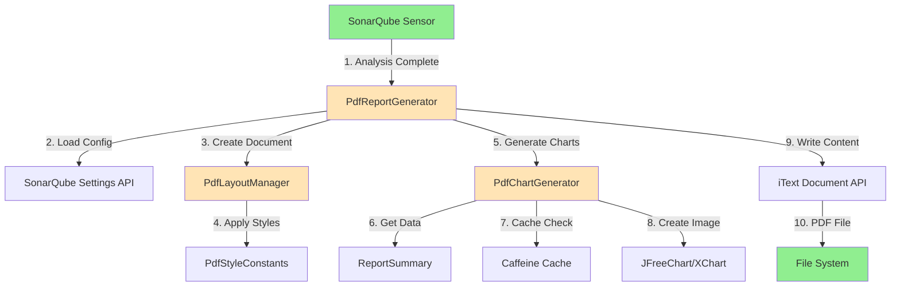

# Component Architecture

## New Components

### Component 1: PdfReportGenerator

**Responsibility:** Main PDF report generation orchestrator implementing ReportGenerator interface

**Integration Points:**
- Implements `ReportGenerator` interface
- Called by SonarQube Sensor after analysis completes
- Delegates to `PdfLayoutManager` for document structure
- Delegates to `PdfChartGenerator` for visual charts

**Key Interfaces:**
```java
public class PdfReportGenerator implements ReportGenerator {
    @Override
    public String generate(AnalysisReport report) throws ReportGenerationException;

    @Override
    public String getFormat();  // Returns "pdf"

    @Override
    public String getFileExtension();  // Returns ".pdf"
}
```

**Dependencies:**
- **Existing Components:** `AnalysisReport` (data input), `SecurityFinding`, `ReportSummary`
- **New Components:** `PdfLayoutManager`, `PdfChartGenerator`, `PdfReportConfig`

**Technology Stack:** Java 11+, iText 7, Caffeine Cache

---

### Component 2: PdfLayoutManager

**Responsibility:** Manages PDF document structure (cover page, TOC, headers/footers, page breaks)

**Integration Points:**
- Called by `PdfReportGenerator` to structure document
- Uses iText `Document`, `PdfWriter`, `PdfPageEventHelper` APIs
- Applies `PdfReportConfig` for branding and styling

**Key Interfaces:**
```java
public class PdfLayoutManager {
    public void createCoverPage(Document doc, AnalysisReport report, PdfReportConfig config);
    public void createTableOfContents(Document doc, List<Section> sections);
    public void addHeaderFooter(PdfWriter writer, PdfReportConfig config);
    public void addPageBreak(Document doc);
}
```

**Dependencies:**
- **Existing Components:** `AnalysisReport` (for cover page data)
- **New Components:** `PdfReportConfig`, `PdfStyleConstants`

**Technology Stack:** iText 7 (Document, PdfWriter, PdfPageEventHelper)

---

### Component 3: PdfChartGenerator

**Responsibility:** Generates visual charts (pie chart for severity, bar chart for OWASP categories)

**Integration Points:**
- Called by `PdfReportGenerator` to create chart images
- Uses `ReportSummary` data for chart generation
- Caches generated charts using Caffeine Cache

**Key Interfaces:**
```java
public class PdfChartGenerator {
    public Image generateSeverityPieChart(ReportSummary summary) throws IOException;
    public Image generateOwaspCategoryBarChart(ReportSummary summary) throws IOException;

    // Internal caching
    private Cache<String, Image> chartCache;
}
```

**Dependencies:**
- **Existing Components:** `ReportSummary` (chart data source), Caffeine Cache
- **New Components:** `PdfStyleConstants` (color definitions)

**Technology Stack:** JFreeChart/XChart (PNG generation), iText 7 (Image embedding), Caffeine Cache

---

### Component 4: PdfStyleConstants

**Responsibility:** Centralized style definitions (colors, fonts, sizes) for PDF reports

**Integration Points:**
- Used by all PDF components for consistent styling
- Supports multiple color themes (DEFAULT, DARK, LIGHT)

**Key Interfaces:**
```java
public class PdfStyleConstants {
    // Severity colors
    public static final Color SEVERITY_BLOCKER = new Color(212, 51, 63);  // #D4333F
    public static final Color SEVERITY_CRITICAL = new Color(255, 165, 0); // #FFA500
    public static final Color SEVERITY_MAJOR = new Color(255, 215, 0);    // #FFD700

    // Fonts
    public static final Font TITLE_FONT = FontFactory.getFont(FontFactory.HELVETICA_BOLD, 24);
    public static final Font CODE_FONT = FontFactory.getFont(FontFactory.COURIER, 10);

    // Color theme support
    public static ColorTheme getTheme(String themeName);
}
```

**Dependencies:** None (pure constants and enums)

**Technology Stack:** Java 11+, iText 7 Font/Color APIs

---

## Component Interaction Diagram



**Interaction Flow:**
1. SonarQube Sensor completes analysis and calls `PdfReportGenerator.generate(report)`
2. PDF generator loads configuration from SonarQube Settings API
3. Creates PDF document structure via `PdfLayoutManager` (cover, TOC, headers/footers)
4. Layout manager applies styles from `PdfStyleConstants` based on configured theme
5. Generates visual charts via `PdfChartGenerator` (severity pie chart, OWASP bar chart)
6. Chart generator extracts data from `ReportSummary`
7. Checks Caffeine Cache for existing chart images (avoids regeneration)
8. If not cached, creates new chart images using JFreeChart/XChart
9. Writes all content (summary, charts, detailed findings) to PDF via iText Document API
10. Saves PDF file to file system with timestamped filename

---
